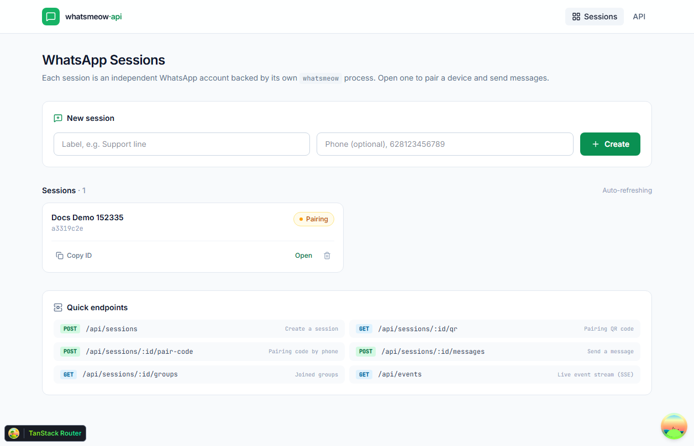
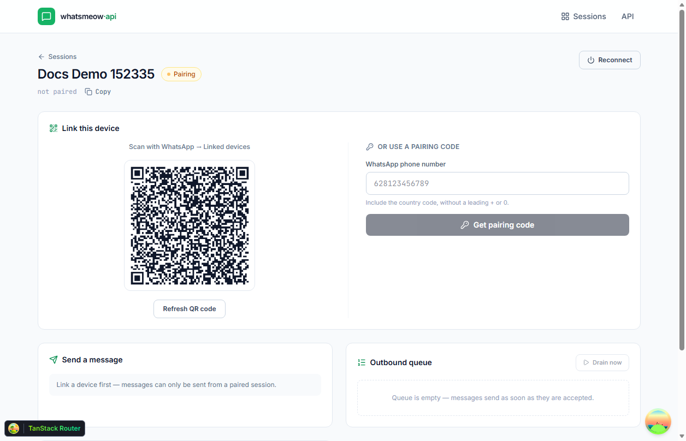
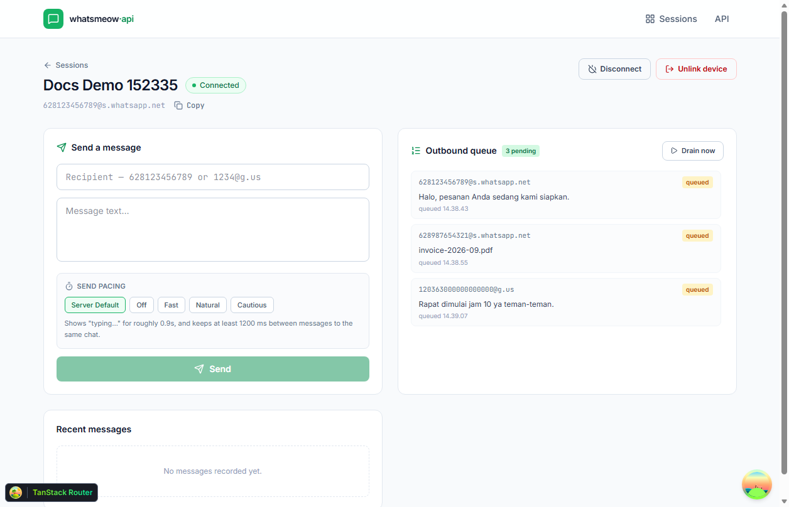
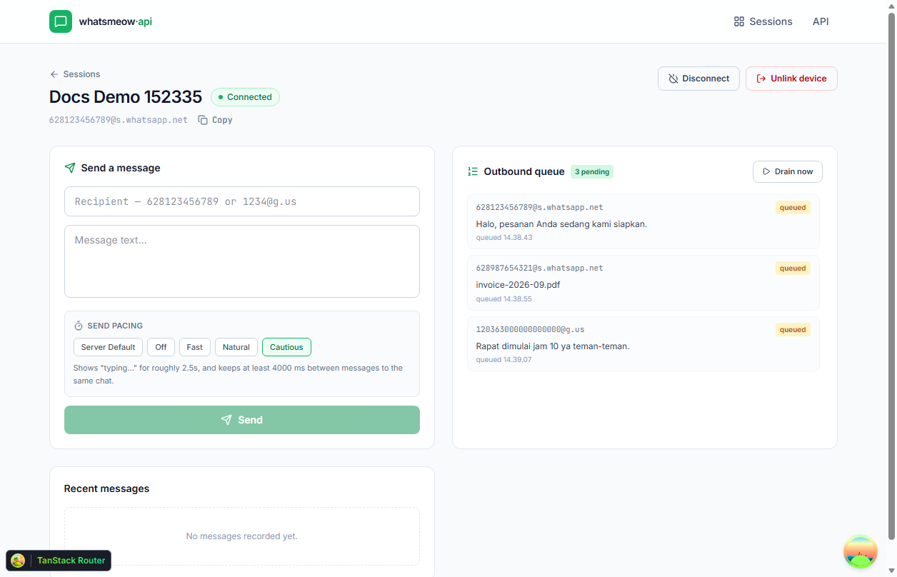
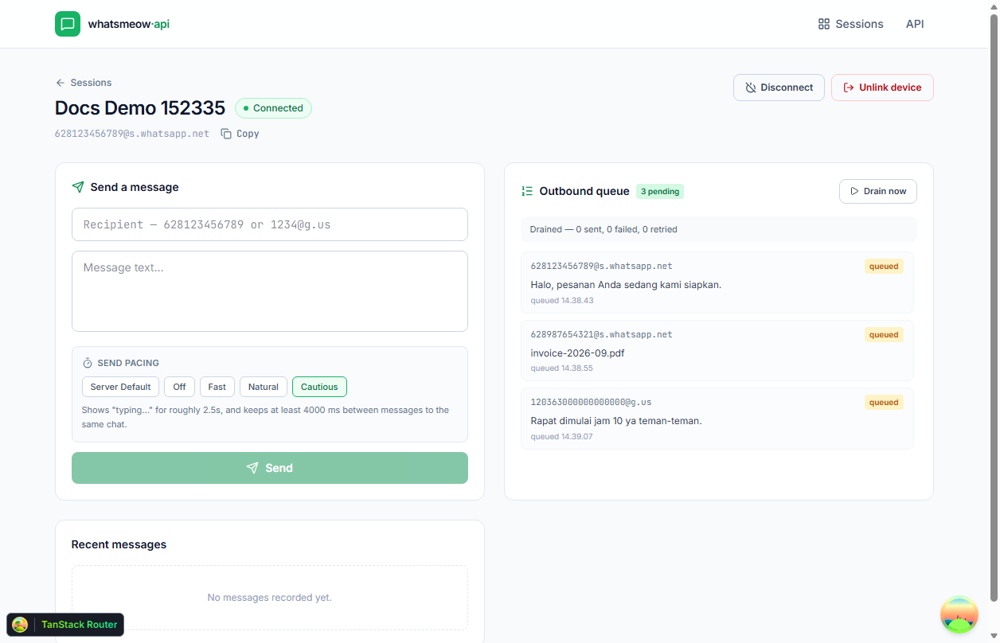

# whatsmeow-api

A RESTful WhatsApp API built on **Hono**, powered by
[`whatsmeow-node`](https://github.com/nicastelo/whatsmeow-node), with a React dashboard.
The architecture follows the [BHVR template](https://github.com/ZulfiFazhar/BHVR-Template)
(Bun · Hono · Vite · React) — N-layered backend with routes → controllers → services →
repositories, and a typed React client.

   

---

## Screenshots

**Sessions dashboard** — each session is an independent WhatsApp account.



**Pairing** — both flows side by side: scan the QR, or read a pairing code out to
the phone.



**A connected session** — composer with the send-pacing controls, and the outbound
queue beside it.



**Send pacing** — presets come from the server, so the controls cannot drift from
the timing model.


**Outbound queue** — durable sends with depth, per-entry status, and a manual drain.



**Drain refuses to lose work** — draining an unpaired session sends nothing and
leaves every entry queued.



---

## What this is

`whatsmeow-node` binds the Go [`whatsmeow`](https://github.com/tulir/whatsmeow) library
over stdin/stdout IPC. It spawns one native Go binary per client, which means:

> **This API runs as a Node/Bun process, not a Cloudflare Worker.**
> Workers have no child processes and cannot ship native binaries, so the WhatsApp
> side of this project is deliberately a long-lived server process. The BHVR
> template's layered structure and its React client are kept as-is; the runtime
> target is not.

## Features

| Area | Endpoints |
|---|---|
| **Sessions** | create, list, get, delete, status |
| **Pairing** | QR code **and** pairing code (phone number) |
| **Connection** | connect, disconnect, logout/unlink |
| **Messages** | text, media (image/video/audio/document), location, contact, poll, raw, reply, react, edit, revoke, mark read |
| **Send pacing** | human-like typing indicator + delay, four presets, per-chat cooldown |
| **Outbound queue** | durable Redis-backed send queue, FIFO, retries, manual drain |
| **Caching** | read-through Redis cache for chat lists and health |
| **Chats** | typing indicator, presence, privacy settings, blocklist, disappearing messages, status message, contact QR |
| **Contacts** | `isOnWhatsApp` check, profile picture, user info, devices, business profile |
| **Groups** | list, create, info, invite links, join/leave, settings, add/remove/promote/demote, join requests |
| **Misc** | health, pacing presets, queue depth, generic IPC escape hatch, message ids, media upload/download |
| **Events** | live Server-Sent Events stream of every gateway event |

---

## Requirements

- **Bun 1.2+** *(recommended)* or **Node.js 22.5+**
- A WhatsApp account (a spare number is strongly advised)
- The `whatsmeow-node` native binary ships automatically via `optionalDependencies` —
  supported on Windows, macOS and Linux (x64 and arm64)

### Bun or Node, your choice

Both run the API; nothing in the codebase is pinned to either.

| | Bun | Node |
|---|---|---|
| Server | `src/server.ts` executed directly | bundled by esbuild into `dist/server`, then run |
| HTTP | `Bun.serve` | `@hono/node-server` |
| SQLite | `bun:sqlite` | `node:sqlite` |

Node cannot execute TypeScript, so `scripts/run-server.mjs` detects which runtime
started it and only builds when it has to. Under Bun there is no build step at all.

SQLite comes from the runtime's own built-in driver on both sides — see
[Why better-sqlite3 is gone](#why-better-sqlite3-is-gone).

## Quick start

```bash
# 1. Install
bun install          # or: npm install

# 2. Configure
cp .env.example .env

# 3. Run both the API and the dashboard
bun run dev
```

- Dashboard → http://localhost:5173
- API → http://localhost:3000/api

Then click **Create**, open the session, and pair it by scanning the QR code with
*WhatsApp → Linked devices*, or use the pairing code flow with your phone number.

### Running the two processes separately

```bash
bun run dev:server   # Hono API on :3000
bun run dev:client   # Vite dev server on :5173, proxies /api → :3000
```

## Docker

```bash
cp .env.example .env     # then set API_KEY — the server refuses to boot without it
docker compose up -d
```

That starts the API on **:3000** and Redis alongside it, with paired sessions and the
SQLite database kept in the `whatsmeow-data` volume. To run without Redis, comment
out `REDIS_URL` in `docker-compose.yml`; the API degrades to sending straight
through.

```bash
docker compose logs -f api    # follow the API
docker compose down           # stop, keeping the volumes
```

The image is Bun-based and ships `src/` as-is — Bun runs TypeScript directly, so
there is no build step and no compiler toolchain in the image.

The **dashboard is not part of the stack**: it is a Vite dev server and the API does
not serve static files. Run it on the host with `bun run dev:client`.

---

### Why better-sqlite3 is gone

The API used to depend on `better-sqlite3`, a native addon. It was the single reason
this project could not run under Bun — loading it panics the Bun process with an
N-API assertion failure — and on Windows it did not even install, because node-gyp
needs a Windows SDK.

Both target runtimes ship SQLite themselves (`bun:sqlite`, `node:sqlite`), so
`src/database/sqlite.ts` picks whichever one is present and Drizzle is bound to it
through `drizzle-orm/sqlite-proxy`. No native module, no compiler, `bun install`
finishes. The only wrinkle: `bunfig.toml` sets `install.peer = false`, because Bun
auto-installs drizzle-orm's optional peers and would otherwise pull
`better-sqlite3` back in.

---

### Why no platform-specific package is pinned in `package.json`

`npm install` used to fail on Linux with

```
npm error code EBADPLATFORM
npm error notsup Unsupported platform for @rollup/rollup-win32-x64-msvc@4.63.5:
npm error notsup wanted {"os":"win32","cpu":"x64"} (current: {"os":"linux","cpu":"x64"})
```

`@rollup/rollup-win32-x64-msvc` is one of Rollup's prebuilt binaries, published as an
`optionalDependency` of `rollup`. Optional dependencies are the mechanism that lets a
single lockfile serve every platform: npm *skips* the entries whose `os`/`cpu` do not
match, instead of failing. That skip only happens for nodes marked `optional`
(`arborist/reify.js`: `if (node.optional) { ... checkPlatform(node.package, false, …) }`,
where a throw is caught and the node rolled back).

The trap: once that package is listed as a **root** dependency it stops being optional,
and npm validate its platform unconditionally in `build-ideal-tree.js`
(`checkPlatform(node.package, this.options.force)` — not guarded by `node.optional`).
On Windows the check passes and nothing looks wrong. On the Linux server the same
lockfile is fatal, and `npm ci` cannot get far enough to install anything — so the
usual escape hatch of running `npm install --force` is not available, because npm is
not there yet.

Do not add a platform-specific `@rollup/*` (or `@esbuild/*`, or `@napi-rs/*`) package
to `dependencies`. `rollup` already pulls the right binary for the current platform on
its own. If a contributor added one to work around a missing-binary error, remove it
and reinstall — the underlying problem is a stale `node_modules`, not a missing
dependency.

---

## Configuration

All settings live in `.env` (see `.env.example`):

| Variable | Default | Purpose |
|---|---|---|
| `PORT` | `3000` | API listen port |
| `HOST` | `127.0.0.1` | API bind address |
| `API_KEY` | _(empty)_ | Sent as `X-API-Key`. **Empty disables auth**; required in production |
| `DATABASE_PATH` | `./data/whatsmeow.db` | SQLite file for sessions, message log, webhooks |
| `SESSION_DIR` | `./data/sessions` | One whatsmeow store per session |
| `WHATSMEOW_COMMAND_TIMEOUT` | `30000` | IPC timeout (ms) against the Go binary |
| `PAIR_CODE_TTL` | `60` | Pairing code validity window (seconds) |
| `REDIS_URL` | _(empty)_ | Redis connection string. **Empty disables the queue and cache** |
| `REDIS_PREFIX` | `whatsmeow` | Key prefix, so one Redis can host several environments |
| `REDIS_CACHE_TTL` | `30` | TTL for cached reads (seconds) |
| `REDIS_QUEUE_BATCH` | `20` | Messages a single drain pass may send before yielding |

The server **refuses to boot in production without `API_KEY`** — an unauthenticated
WhatsApp account control panel is not something to expose by accident.

### Redis (optional)

Redis powers two things, and **neither is required**:

- **A durable outbound queue.** A send is accepted into the queue and delivered by
  a worker, so a burst survives an API restart and a disconnected session catches
  up on reconnect.
- **A read-through cache** for chat lists and health, keeping dashboard polling off
  SQLite.

```bash
# No Redis? Leave REDIS_URL empty. Sends go straight through; caching is skipped.
REDIS_URL=
```

The API is **fail-open** by design: if Redis is configured but unreachable, the
affected features degrade rather than fail. `/health` reports the distinction —
`enabled: true, available: false` means "running without the queue right now", not
"broken". Same for `GET /queue`.

#### Queue semantics

| Property | Behaviour |
|---|---|
| Ordering | FIFO per session |
| Durability | Survives a restart; in-flight entries recovered on boot |
| Retries | Up to 3 attempts on transient errors, then marked failed |
| Backoff | A retried message goes to the **back** of the line, not the front |
| Refusal | An unpaired session is left untouched, not consumed |
| Delivery | Automatic on `session:connected`, plus a 5-second sweep |

Because a queued send returns `{ "queued": true, "queuePosition": 3 }` rather than a
message id, that response means **accepted, not delivered**. Pass
`"immediate": true` on the send to bypass the queue and wait for the real send when
you need the WhatsApp message id.

#### Redis 3.2 compatibility

The client pins **RESP 2**. Redis 6+ defaults to RESP 3, whose handshake opens with
`HELLO` — a command Redis 3.2 does not implement. Without the pin the connection
never opens and the fail-open path silently disables Redis. If you run against an
older Redis (Laragon ships 3.2 on Windows), this is why it matters.

#### Managing the queue

```bash
curl http://localhost:3000/api/queue                      # depth + counters, all sessions
curl http://localhost:3000/api/sessions/<id>/misc/queue    # one session, oldest first
curl -X POST http://localhost:3000/api/sessions/<id>/misc/queue/drain
```

Full details in [docs/API.md](docs/API.md#outbound-queue-redis).

### Client-side API key

If you set `API_KEY`, the dashboard needs it too. Create `.env.local`:

```
VITE_API_KEY=your-key-here
```

### Dashboard sign-in

The dashboard sits behind a login screen at `/login`. Any other URL redirects
there, remembering where you were headed, and returns you afterwards:

```
/                → /login?redirect=/
/sessions/abc    → /login?redirect=/sessions/abc
```

Credentials are build-time values, so they belong in `.env.local` next to the
API key:

```
VITE_DASHBOARD_USERNAME=admin
VITE_DASHBOARD_PASSWORD=change-me
```

With no `VITE_DASHBOARD_PASSWORD` set, the app falls back to `admin` / `admin`
and the login screen shows a warning banner. A sign-in lasts 12 hours and is
stored in `localStorage`; "Sign out" in the header clears it.

> **This is a UI gate, not a security boundary.** The values are compiled into
> the JavaScript bundle, so anyone who can load the dashboard can read them —
> and the REST API answers with or without a login, exactly as before. It keeps
> casual visitors out of the dashboard; it does not protect the API. That
> protection is `API_KEY`, and only `API_KEY`.

---

## API reference

> **Full reference → [docs/API.md](docs/API.md)** — every endpoint, field, and
> error code. The section below covers the common flows.

Every response uses the same envelope:

```json
{ "success": true, "message": "…", "data": { } }
```

Errors carry `success: false` and put the error code in `data.code`.

### Sessions

```bash
# Create
curl -X POST http://localhost:3000/api/sessions \
  -H 'Content-Type: application/json' \
  -d '{"label":"Support","phoneNumber":"628123456789"}'

# Pair — QR code
curl http://localhost:3000/api/sessions/<id>/qr

# Pair — pairing code
curl -X POST http://localhost:3000/api/sessions/<id>/pair-code \
  -H 'Content-Type: application/json' \
  -d '{"phoneNumber":"628123456789"}'

# Status / lifecycle
curl http://localhost:3000/api/sessions/<id>/status
curl -X POST http://localhost:3000/api/sessions/<id>/disconnect
curl -X POST http://localhost:3000/api/sessions/<id>/logout   # unlink device
```

### Messages

```bash
# Text
curl -X POST http://localhost:3000/api/sessions/<id>/messages \
  -H 'Content-Type: application/json' \
  -d '{"to":"628123456789","text":"Hello from the API"}'

# Image from a URL
curl -X POST http://localhost:3000/api/sessions/<id>/messages \
  -H 'Content-Type: application/json' \
  -d '{"to":"628123456789","type":"image","mediaUrl":"https://example.com/cat.jpg","caption":"Nice"}'

# Reply to a message
curl -X POST http://localhost:3000/api/sessions/<id>/messages \
  -H 'Content-Type: application/json' \
  -d '{"to":"628123456789","text":"Agreed","replyTo":"3EB0...","replyToText":"original"}'

# Location
curl -X POST http://localhost:3000/api/sessions/<id>/messages \
  -H 'Content-Type: application/json' \
  -d '{"to":"628123456789","type":"location","latitude":-6.2,"longitude":106.8,"locationName":"Jakarta"}'
```

`to` accepts a bare phone number (country code, no `+`) or a full JID
(`1234@g.us` for groups).

#### Send pacing (anti-ban)

Every outgoing message is paced by default. Before the message is sent the
session shows a **typing…** indicator, waits an amount of time proportional to
how long a person would need to type the text, and only then sends. Messages to
the same chat are also spaced apart by a cooldown.

Timing is deliberately random within a band — uniform intervals are themselves a
bot signal.

| Preset | Typing | Base pause | Per character | Cap | Chat cooldown |
|---|---|---|---|---|---|
| `off` | no | — | — | — | — |
| `fast` | yes | 400 ms | 12 ms | 2.5 s | 250 ms |
| `natural` *(default)* | yes | 900 ms | 45 ms | 8 s | 1.2 s |
| `cautious` | yes | 2.5 s | 80 ms | 18 s | 4 s |

Pass a preset, or override individual knobs, per request:

```bash
# Use a preset
curl -X POST http://localhost:3000/api/sessions/<id>/messages \
  -H 'Content-Type: application/json' \
  -d '{"to":"628123456789","text":"Hello","pacing":{"preset":"cautious"}}'

# Send immediately — no typing indicator, no delay
curl -X POST http://localhost:3000/api/sessions/<id>/messages \
  -H 'Content-Type: application/json' \
  -d '{"to":"628123456789","text":"Hello","pacing":{"preset":"off"}}'

# Fine-grained control
curl -X POST http://localhost:3000/api/sessions/<id>/messages \
  -H 'Content-Type: application/json' \
  -d '{"to":"628123456789","text":"Hello","pacing":{"preset":"fast","maxDelayMs":1500,"chatCooldownMs":0}}'
```

Omit `pacing` entirely to accept the `natural` default. The available presets are
also readable at `GET /api/pacing`, which is what the dashboard's composer uses
so its controls cannot drift from the server's timing model.

Two implementation notes worth knowing:

- **Pacing runs inside a per-chat queue.** Concurrent requests to the same chat
  are serialised, so the cooldown is actually enforced rather than measured
  independently by each request — which would defeat the point.
- **The typing indicator is best-effort.** If the presence receipt fails, the
  message is still sent. The indicator is a courtesy; the message is the point.

### Groups, contacts, chats

```bash
curl http://localhost:3000/api/sessions/<id>/groups
curl -X POST http://localhost:3000/api/sessions/<id>/groups \
  -H 'Content-Type: application/json' \
  -d '{"name":"Team","participants":["628111","628222"]}'

curl -X POST http://localhost:3000/api/sessions/<id>/contacts/check \
  -H 'Content-Type: application/json' \
  -d '{"phones":["628123456789"]}'

# Typing indicator
curl -X POST http://localhost:3000/api/sessions/<id>/chats/typing \
  -H 'Content-Type: application/json' \
  -d '{"chat":"628123456789","state":"composing"}'
```

### Live events (SSE)

```bash
curl -N http://localhost:3000/api/events
curl -N 'http://localhost:3000/api/events?sessionId=<id>&events=message,session:status'
```

Events: `session:qr`, `session:pair-code`, `session:status`, `session:connected`,
`session:disconnected`, `session:logged-out`, `session:error`, `message`,
`message:receipt`, `presence`, `call`.

### Escape hatch

Any whatsmeow IPC method can be invoked directly when no REST endpoint exists:

```bash
curl -X POST http://localhost:3000/api/sessions/<id>/misc/call \
  -H 'Content-Type: application/json' \
  -d '{"method":"getNewsletterInfo","args":{"jid":"123@newsletter"}}'
```

---

## Architecture

```
src/
├── api/                    # Hono backend
│   ├── index.ts            # app assembly, middleware, error handler
│   ├── sessions/           # route → controller → service
│   ├── messages/
│   ├── chats/
│   ├── contacts/
│   ├── groups/
│   ├── misc/
│   ├── middlewares/        # apiKeyAuth
│   └── utils/response.ts   # response envelope
├── lib/whatsapp/           # the gateway
│   ├── clientManager.ts    # one Go subprocess per session
│   ├── eventBus.ts         # in-process event fan-out
│   ├── messages.ts         # proto payload building
│   ├── pacing.ts           # typing indicator + delay scheduler
│   └── messageLogger.ts    # inbound persistence
├── lib/redis/              # optional durability + caching (fail-open)
│   ├── client.ts           # lazy RESP-2 connection
│   ├── messageQueue.ts     # list-based queue primitives
│   ├── queueWorker.ts      # drain loop, retries, recovery
│   └── cache.ts            # read-through cache
├── database/               # Drizzle + SQLite
│   ├── db.ts
│   ├── schema.ts
│   └── repositories/
├── routes/                 # React pages (TanStack Router, file-based)
│   ├── __root.tsx          # outlet + devtools, nothing else
│   ├── login.tsx           # public sign-in screen
│   ├── _authenticated.tsx  # pathless layout: beforeLoad guard + app header
│   └── _authenticated/     # every page behind the guard
│       ├── index.tsx       #   session list  (/)
│       └── sessions.$sessionId.tsx
├── components/
│   ├── ui/                 # Button, Field, Card, Alert, ConfirmDialog, …
│   ├── dashboard/          # session list pieces
│   └── sessions/           # session detail panels
├── lib/auth/               # client-side sign-in gate (store, hook, guard)
├── services/               # client-side API layer
├── types/
└── server.ts               # bootstrap
```

**Adding a page:** drop a file in `src/routes/_authenticated/`. It inherits the
sign-in guard and the header automatically; only `/login` is public.

docs/
├── API.md                  # full endpoint reference
└── images/                 # screenshots used above
```

**Request flow:** route → controller (parse/shape) → service (business logic) →
repository (data) → response envelope.

### Session lifecycle

```
create → clientManager.ensure()
       → init()                    # reads the on-disk store
       → already paired ?  connect() → "connected"
       → not paired      ? getQRChannel() → connect() → "pairing"
                         → qr / pairCode events
                         → "connected"
```

One `createClient()` call = one Go subprocess. `disconnect()` keeps the process
alive (whatsmeow auto-reconnects); `destroy()` and `removeStore()` free it.

---

## Scripts

| Script | Purpose |
|---|---|
| `bun run dev` | API + dashboard together |
| `bun run dev:server` | Hono API — Bun runs `src/server.ts` with `--watch`; Node bundles first |
| `bun run dev:client` | Vite dev server |
| `bun run build` | Type-check + build client + bundle server |
| `bun test` | Vitest unit tests |
| `bun run typecheck` | `tsc -b` across both projects |
| `bun run db:push` | Push the Drizzle schema to SQLite |
| `bun run db:studio` | Drizzle Studio |

Every script above also works as `npm run …` — the runner uses whichever runtime
launched it.

---

## Verification

Verified end to end on Windows 11, under **Bun 1.3.14** and **Node 22.22.2**:

- `bun test` — 87 unit tests pass
- `bun run typecheck` — clean across both projects
- `npm run build` — client and server bundles emit
- The sign-in gate is asserted against the real generated route tree, not a mock
  (`tests/routing.test.ts`, 5 cases): an anonymous visit to `/` or
  `/sessions/:id` lands on `/login` carrying the original path as `?redirect=`,
  a signed-in visit renders the dashboard, `/login` bounces a signed-in user
  back to `/`, and signing out returns to `/login`
- Server boots under both runtimes, `/api/sessions/health` returns `ok`
- Both runtimes read the same SQLite file — a session created under Bun is
  visible after a restart under Node
- The repository layer was probed directly against a real database under each
  runtime: insert-returning, find, update-returning, paged list with count,
  grouped chat list, status update and delete all return identical rows
- Creating a session spawns the Go binary; `/qr` returns a real
  `wa.me/settings/linked_devices#…` pairing string
- Dashboard driven in a real browser (Edge over CDP): session created through the
  form, QR rendered at 240×240 from the live server, both pairing flows visible,
  console clean, session deleted through the UI. **The screenshots above are those
  captures** — see `outputs/docs-screenshots.mjs` (20/20 checks)
- Send pacing measured, not just asserted: `off` makes zero presence calls and
  returns in 0 ms, while `natural` sends `composing → paused` around a ~0.7 s pause
  for a short message and a ~4.4 s pause for a 120-character one

### Redis, proven against a live server

The queue and cache are verified against a **real Redis 3.2.100**, not a mock
(`outputs/_queue-integration.mjs`, 21/21 checks):

- **FIFO order, claim/settle, requeue-to-back, crash recovery** preserving order
- **The cache is live, not decorative.** Poisoning `whatsmeow:cache:chats:<sid>:50`
  with a sentinel and re-calling the API returns **the sentinel** — proving the
  read-through path is on the hot path. A 30 s TTL was then observed counting down.
- **Fail-open proven.** With Redis shut down, `/chats` still returned 200 with real
  SQLite data, `/health` reported `enabled: true, available: false`, and `/queue`
  answered instead of erroring.
- **Automatic recovery proven.** After restarting Redis — with no app restart —
  `available` flipped back to `true` and the cache repopulated.
- **Queue durability proven.** Draining an unpaired session left the message
  `queued` at `depth: 1` rather than consuming it.
- **Purge proven.** Deleting a session removed its queue list, payload, session
  registration and cache keys, leaving only the global counters.

Two real bugs were found this way and fixed: RESP 3 negotiation failing against
Redis 3.2, and the queue being read in the wrong direction (Redis stores it
newest-first, so the drain order cannot be expressed as a range slice).

---

## Security & operational notes

- **Auth is off by default.** Set `API_KEY` before exposing this beyond localhost.
  The server enforces this in production.
- **The dashboard login is not API auth.** `/login` is a client-side gate; its
  credentials ship inside the bundle. It keeps casual visitors off the
  dashboard, but every REST endpoint still answers to whoever holds the
  `API_KEY` — and to anyone at all when `API_KEY` is empty.
- **Session stores are live credentials.** `data/` is gitignored. Anyone with
  `data/sessions/*.db` can act as the linked account — treat it like a password,
  and pair a spare number rather than a personal one.
- **Anti-ban guidance.** WhatsApp rate-limits unofficial clients; accounts *can* be
  banned. Every send is paced by default (see
  [Send pacing](#send-pacing-anti-ban)): a typing indicator, a proportional pause,
  and a per-chat cooldown. That reduces the risk but does not remove it — avoid bulk
  blasts on a freshly paired number, and watch for `stream_error` /
  `keep_alive_timeout` / `temporary_ban` events. The API surfaces these on the event
  stream but does not stop sending on your behalf.
- **`logged_out` is terminal.** When a user unlinks the device from their phone, the
  store is invalidated and the session must be re-paired from scratch.
- **Not affiliated with WhatsApp.** This uses an unofficial client library, which may
  violate WhatsApp's Terms of Service. Use at your own risk.

---

## License

MIT for this project. `whatsmeow-node` is MIT; `whatsmeow` is MPL-2.0.
